# Assume Privileged Role with External ID

## Objective
Starting from an IP address, escalate privileges by assuming
a privileged AWS role using a discoverable External ID.

## Tools Used
- nmap
- ffuf
- AWS CLI
- aws-enumerator
- AWS CloudShell

## Attack Chain

### Step 1 — Port scanning
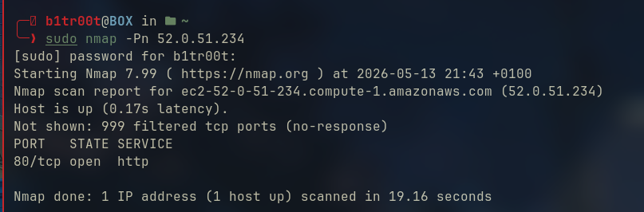

### Step 2 — Directory fuzzing with ffuf
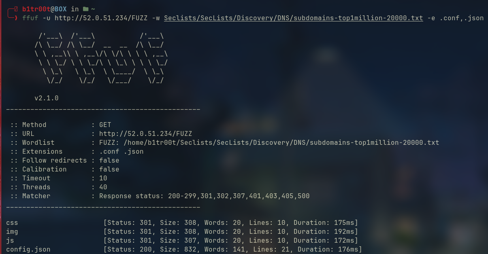

### Step 3 — config.json credentials
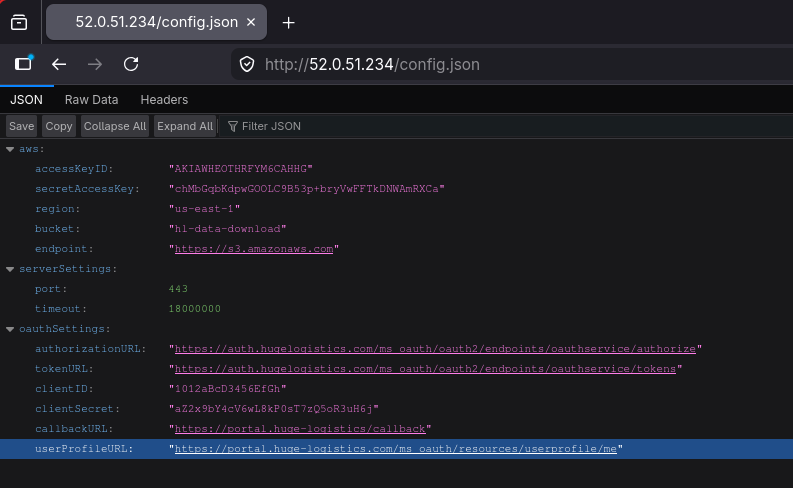

### Step 4 — Verify identity as data-bot
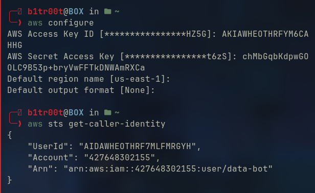

### Step 5 — Enumerate permissions


### Step 6 — List secrets
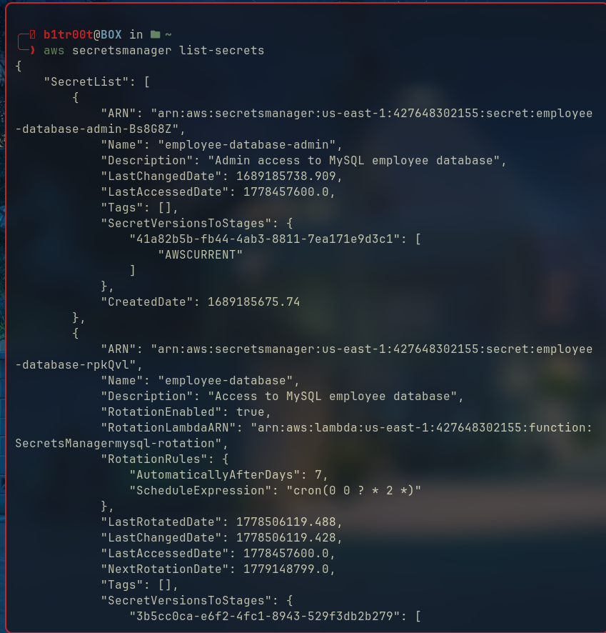

### Step 7 — Get ext/cost-optimization secret
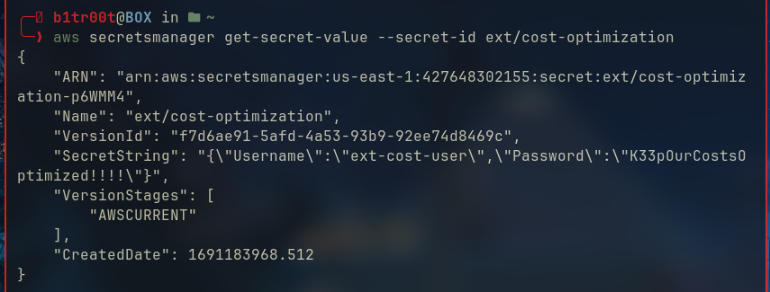

### Step 8 — Login to AWS console as ext-cost-user
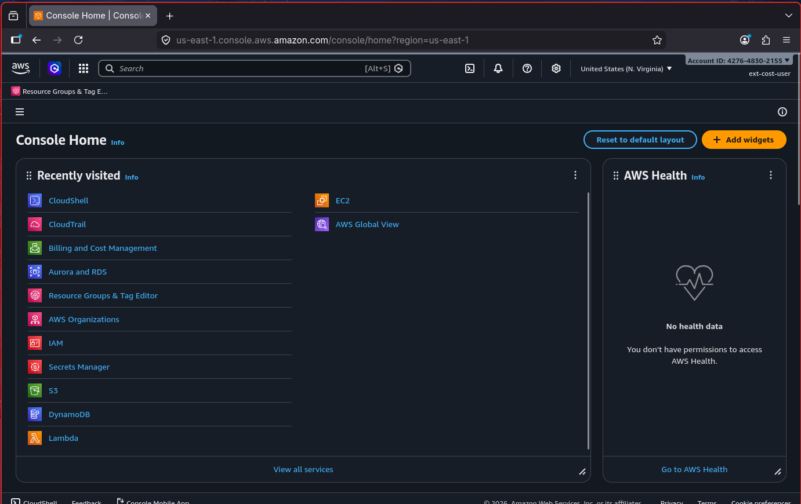

### Step 9 — Discover get_creds.sh in CloudShell
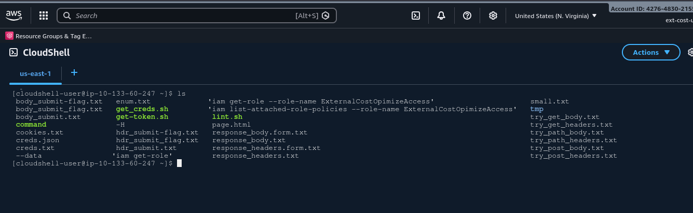

### Step 10 — Get temporary credentials
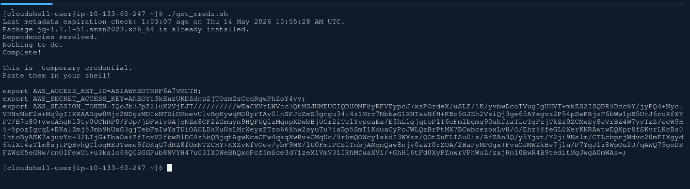

### Step 11 — Enumerate ext-cost-user policies
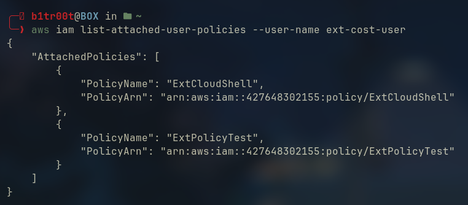

### Step 12 — Discover ExternalCostOpimizeAccess role
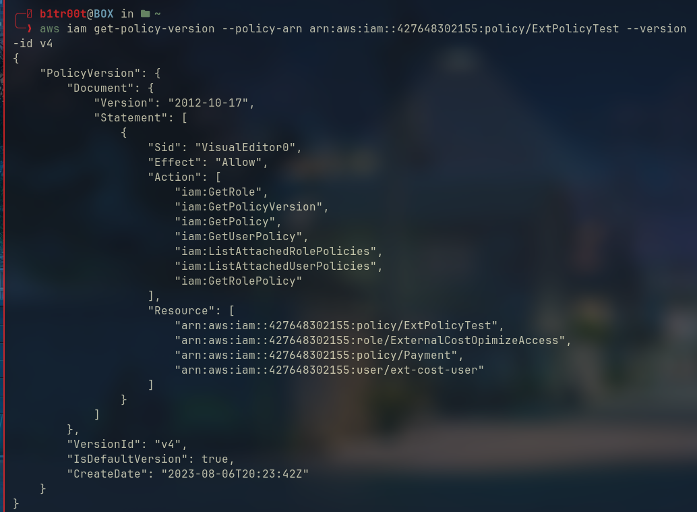

### Step 13 — Find External ID in trust policy
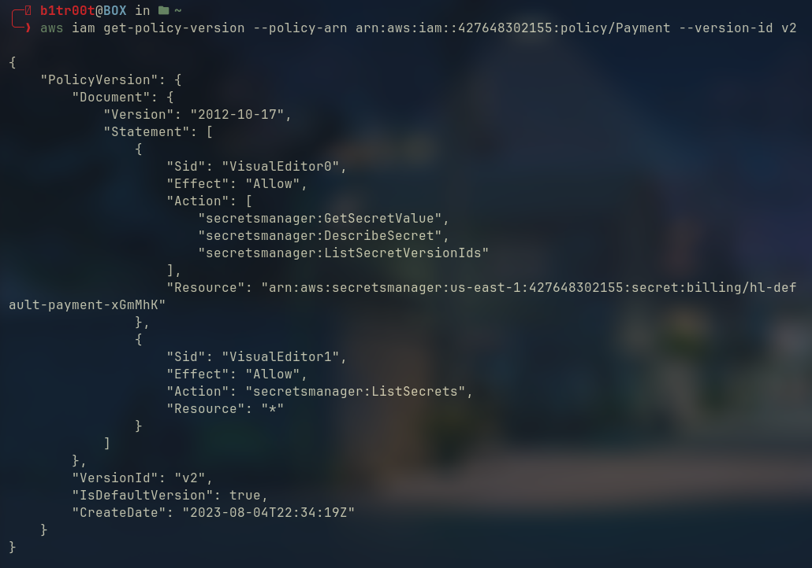

### Step 14 — Assume the role with External ID
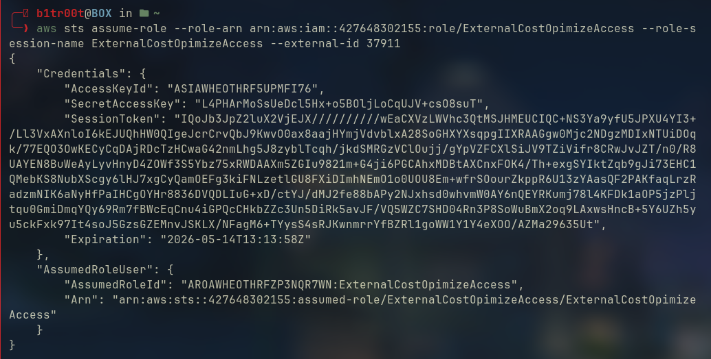

### Step 15 — Access billing secret and get flag
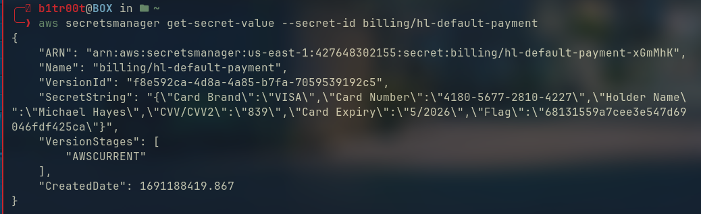

## Key Concept — External ID Abuse
External ID is a security mechanism designed to prevent
the confused deputy problem. However if IAM policies are
readable by an attacker the External ID can be discovered
and used to assume privileged roles.

## Attack Chain Summary
\```
Exposed config.json → AWS credentials
        ↓
data-bot → secretsmanager access
        ↓
ext-cost-optimization secret → ext-cost-user creds
        ↓
CloudShell → temporary credentials
        ↓
Readable IAM policies → External ID discovered (37911)
        ↓
sts:AssumeRole + External ID → privileged role assumed
        ↓
billing/hl-default-payment secret → flag ✅
\```

## Security Failures & Fixes

| Failure | Fix |
|---|---|
| config.json exposed on web server | Never store credentials in web root |
| AWS credentials in config file | Use IAM roles for EC2 instances |
| External ID discoverable via IAM | Restrict iam:GetRole permissions |
| Secrets manager accessible | Apply least privilege |
| Billing secrets accessible after role assumption | Restrict role permissions |

## Flag
`68131559a7cee3e547d69046fdf425ca`