## Difficulty
🟡 Intermediate

## Objective
Find leaked AWS credentials hidden in a Docker image and
CodeCommit git history to gain access to an S3 bucket
containing the flag.

## Tools Used
- Docker
- AWS CLI
- aws-enumerator

---

## Step 1 — Find the Docker image on Docker Hub

Searched Docker Hub for images related to Huge Logistics:

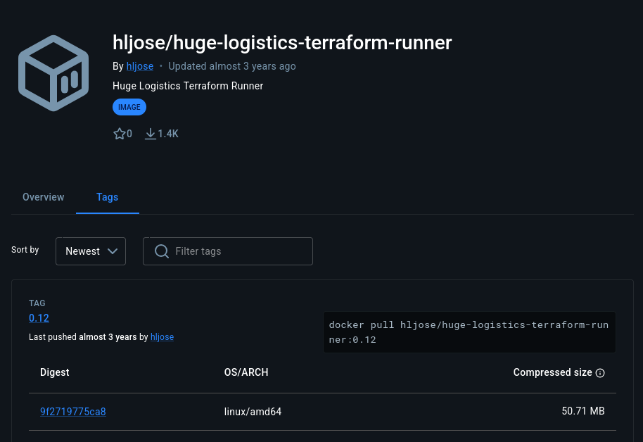

Found: `hljose/huge-logistics-terraform-runner:0.12`

---

## Step 2 — Inspect Docker image metadata

```bash
docker image inspect hljose/huge-logistics-terraform-runner:0.12 -f json
```

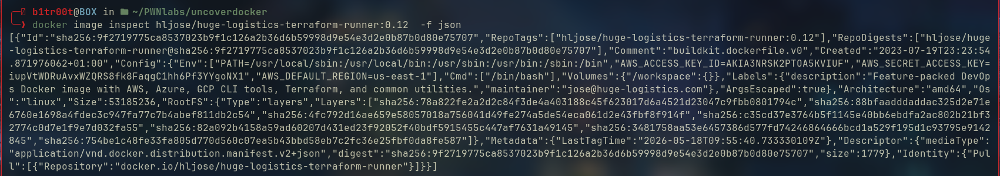

Found AWS credentials leaked in the image environment variables:
- AWS_ACCESS_KEY_ID
- AWS_SECRET_ACCESS_KEY
- AWS_DEFAULT_REGION: us-east-1

---

## Step 3 — Verify identity as prod-deploy

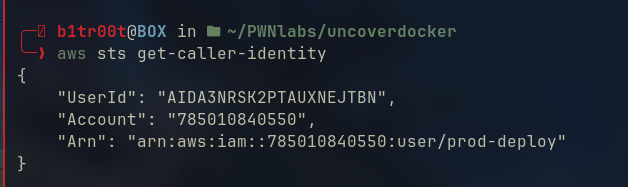

Confirmed: `arn:aws:iam::785010840550:user/prod-deploy`

---

## Step 4 — Enumerate permissions

Used aws-enumerator to discover permissions:

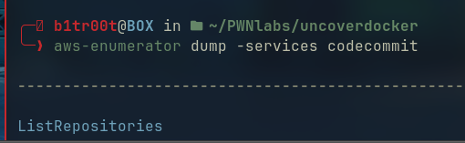

Found:
- STS: full access
- CodeCommit: ListRepositories
- DynamoDB: some access

---

## Step 5 — List CodeCommit repositories

```bash
aws codecommit list-repositories
```

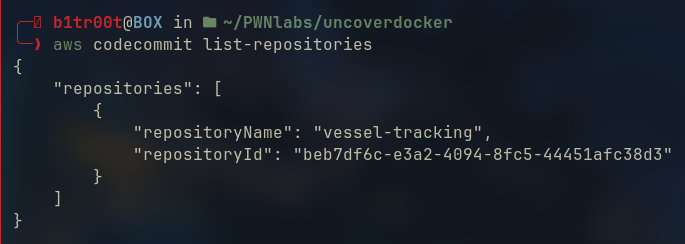

Found repository: `vessel-tracking`

---

## Step 6 — Enumerate branches

```bash
aws codecommit list-branches --repository-name vessel-tracking
```

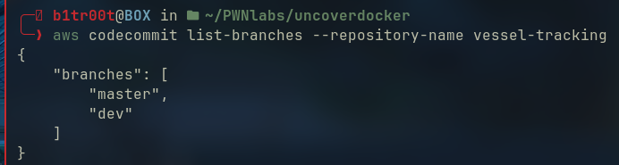

Found 2 branches: `master` and `dev`

---

## Step 7 — Check master branch

Master branch had only an initial commit — nothing interesting.

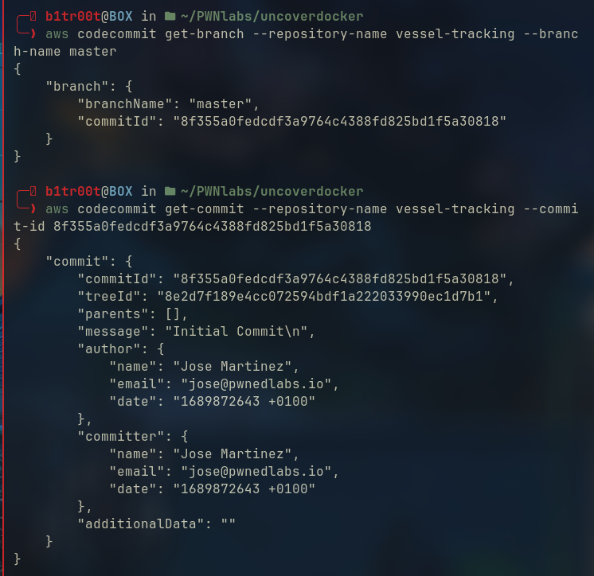

---

## Step 8 — Check dev branch — hidden history found

```bash
aws codecommit get-branch \
  --repository-name vessel-tracking \
  --branch-name dev
```

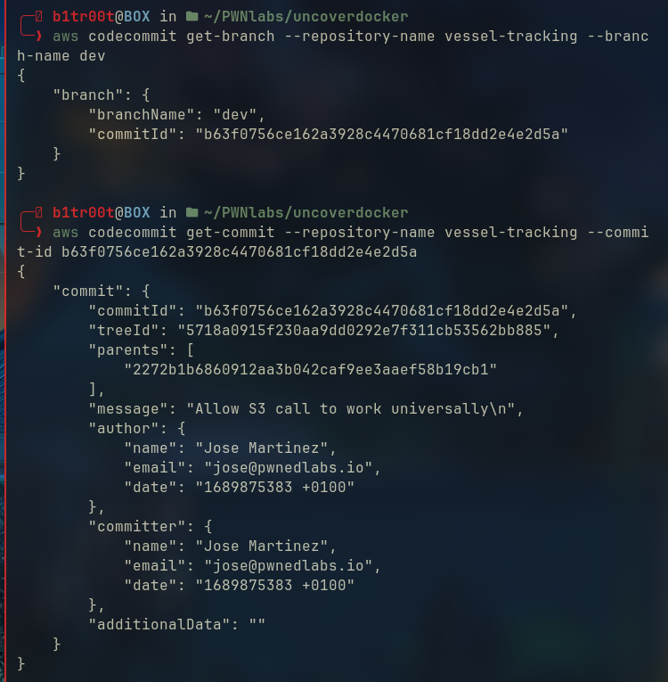

Dev branch commit had a **parent commit** — meaning there is
older hidden history worth investigating.

---

## Step 9 — Get differences between commits

```bash
aws codecommit get-differences \
  --repository-name vessel-tracking \
  --before-commit-specifier 2272b1b6860912aa3b042caf9ee3aaef58b19cb1 \
  --after-commit-specifier b63f0756ce162a3928c4470681cf18dd2e4e2d5a
```

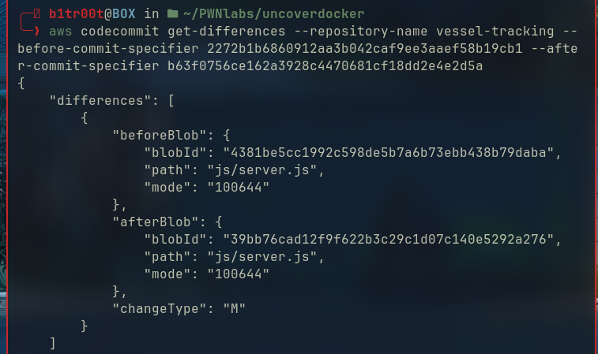

Found 2 blobs of `js/server.js` — a before and after version.

---

## Step 10 — Check first blob

First blob (newer version) contained only base64 encoded JS code.
Decoded content showed no credentials — developer had removed them.

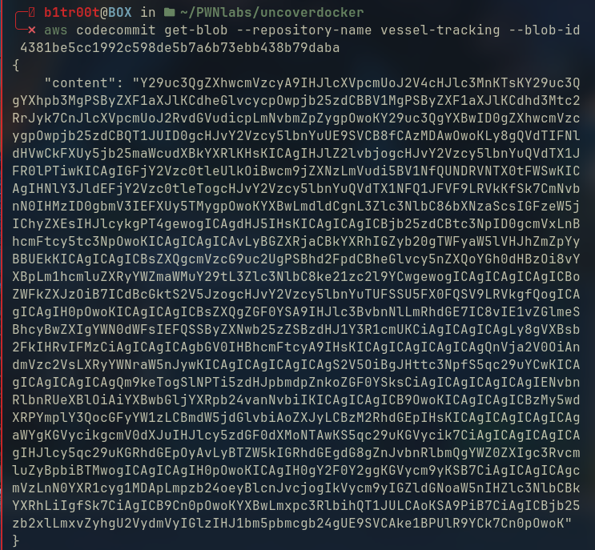

---

## Step 11 — Check second blob — credentials found!

Second blob (older version — the parent commit) contained
hardcoded AWS credentials directly in the source code:

```javascript
const AWS_ACCESS_KEY = 'AKIA**************XXXX';
const AWS_SECRET_KEY = '****************************XXXX';
```

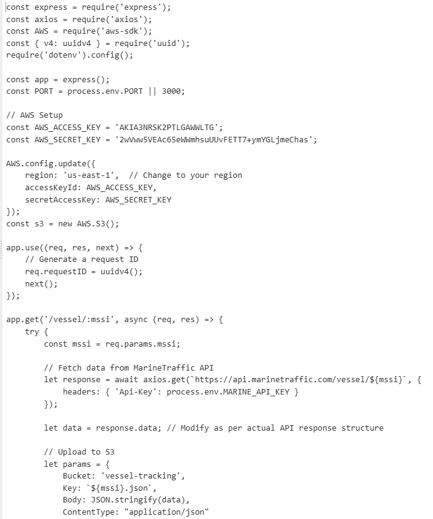

Also found S3 bucket name: `vessel-tracking`

---

## Step 12 — Access account as code-admin

Used the discovered credentials:

```bash
aws sts get-caller-identity
```

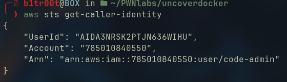

Confirmed: `arn:aws:iam::785010840550:user/code-admin`

---

## Step 13 — Access vessel-tracking S3 bucket

```bash
aws s3 ls s3://vessel-tracking
```

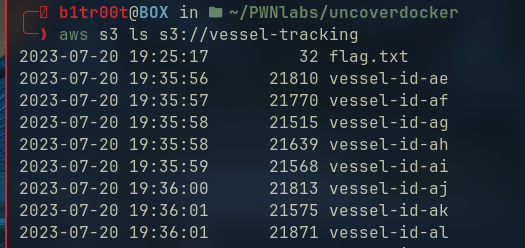

Found `flag.txt` in the bucket.

**Flag:** `[flag value]`

---

## Attack Chain Summary
Docker Hub → hljose/huge-logistics-terraform-runner ↓ docker inspect → AWS credentials in image ENV vars ↓ prod-deploy user → CodeCommit access ↓ vessel-tracking repo → master + dev branches ↓ dev branch → parent commit (hidden history) ↓ get-differences → 2 versions of server.js ↓ older blob → hardcoded AWS credentials ↓ code-admin user → vessel-tracking S3 bucket ↓ flag.txt retrieved ✅

```

## Key Concepts

### Docker Image Secret Leakage
Environment variables set during `docker build` are permanently
baked into the image layers. Even if removed in a later layer,
forensic tools can extract them from earlier layers.

**Fix:** Never use real credentials as build-time ENV vars.
Use Docker secrets or AWS IAM roles for EC2/ECS instead.

### Git History Forensics
Removing credentials in a new commit does NOT erase them.
The parent commit still contains the original file with secrets.
Tools like Trufflehog automate this search across all commits.

**Fix:** Use `git filter-branch` or BFG Repo Cleaner to purge
secrets from git history. Rotate all exposed credentials immediately.

## Security Failures & Fixes

| Failure | Fix |
|---|---|
| AWS credentials in Docker image ENV | Use IAM roles, never hardcode credentials |
| Credentials committed to git | Use .gitignore for .env files |
| Credentials in git history | Rotate keys + purge history with BFG |
| S3 bucket accessible with old credentials | Rotate credentials immediately after exposure |
| No secret scanning | Use trufflehog in CI/CD pipeline |
```