# Execute and Identify Credential Abuse in AWS

## Objective
Starting from a publicly accessible S3 bucket, execute a full 
credential abuse attack chain to gain AWS console access.

## Tools Used
- AWS CLI
- Pacu
- John the Ripper
- GoAWSConsoleSpray

---

## Step 1 — Enumerate the public S3 bucket

I was provided with a publicly accessible S3 bucket.
Listed all objects without authentication using `--no-sign-request`:

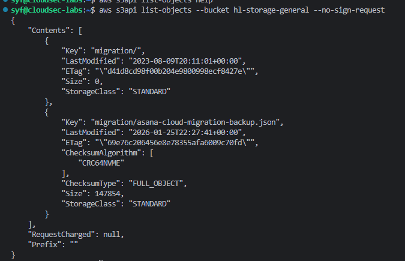

Found an interesting file: `migration/asana-cloud-migration-backup.json`

---

## Step 2 — Extract credentials from the backup file

Downloaded the file and searched for credentials using `grep`:

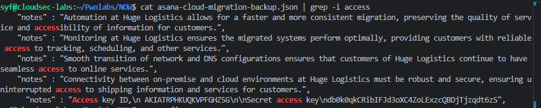

Found hardcoded AWS credentials inside the JSON backup file.

---

## Step 3 — Configure AWS CLI and verify identity

Configured AWS CLI with the stolen credentials and verified access:

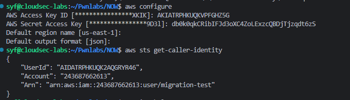

Confirmed identity as `arn:aws:iam::243687662613:user/migration-test`

---

## Step 4 — Enumerate IAM permissions with Pacu

Used Pacu's `iam__bruteforce_permissions` module to discover
what this account can do:

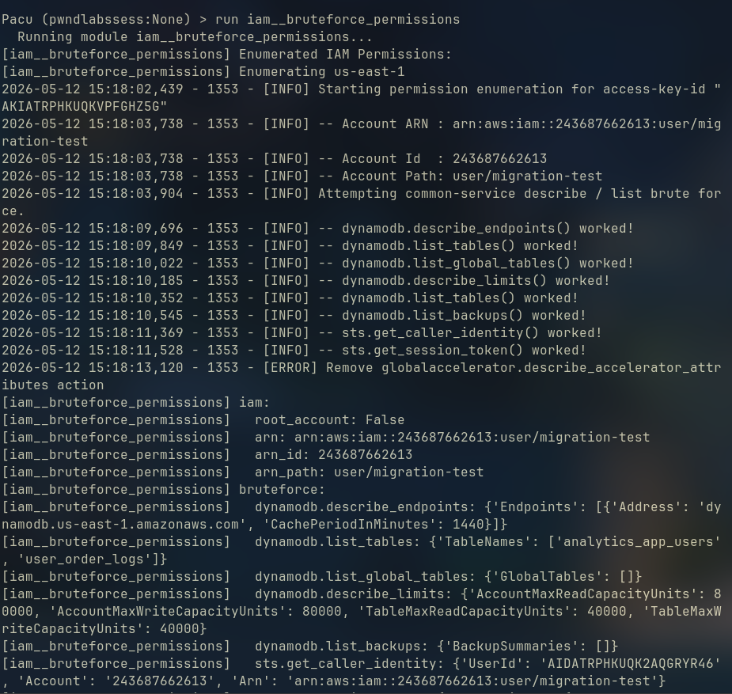

Discovered DynamoDB read access across 4 regions:
- us-east-1
- us-east-2
- us-west-1
- us-west-2

---

## Step 5 — Dump DynamoDB tables

Used Pacu's `dynamodb__enum` module targeting us-east-1:

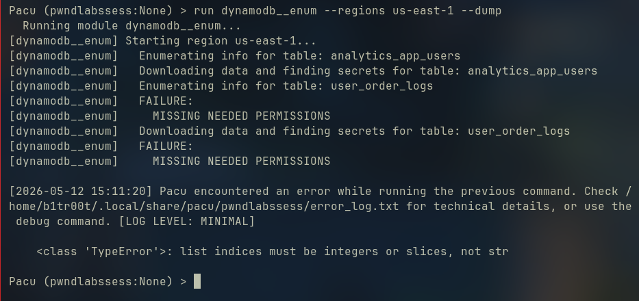

Found 2 tables:
- `analytics_app_users` → dumped successfully
- `user_order_logs` → missing permissions via CLI

Downloaded file location:
`/home/user/pacu/sessions/pwndlabssess/downloads/`

---

## Step 6 — Extract the downloaded data

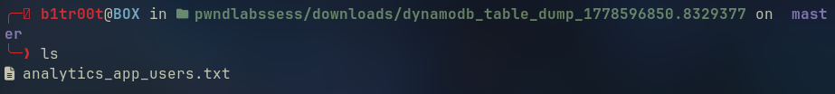

Found `analytics_app_users.txt` containing 51 users with:
- Emails
- First and last names
- Roles
- Password hashes

---

## Step 7 — Crack password hashes with John the Ripper

Created a `username:hash` file and ran John the Ripper:

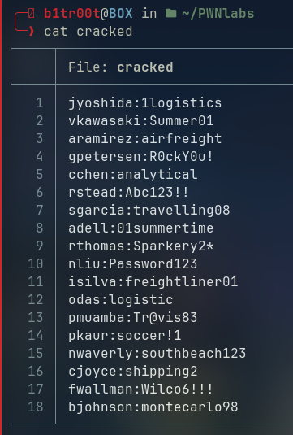

Successfully cracked 18 out of 51 password hashes.

---

## Step 8 — Password spray AWS console

Used GoAWSConsoleSpray against account `243687662613`:

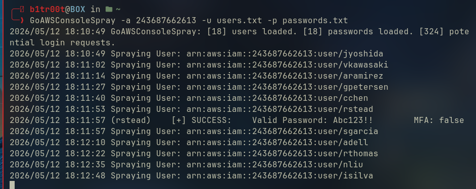

Got a valid hit: `rstead:Abc123!!`
MFA was not enabled — spray succeeded directly.

---

## Step 9 — Log into AWS console

Used the valid credentials to access the AWS console:

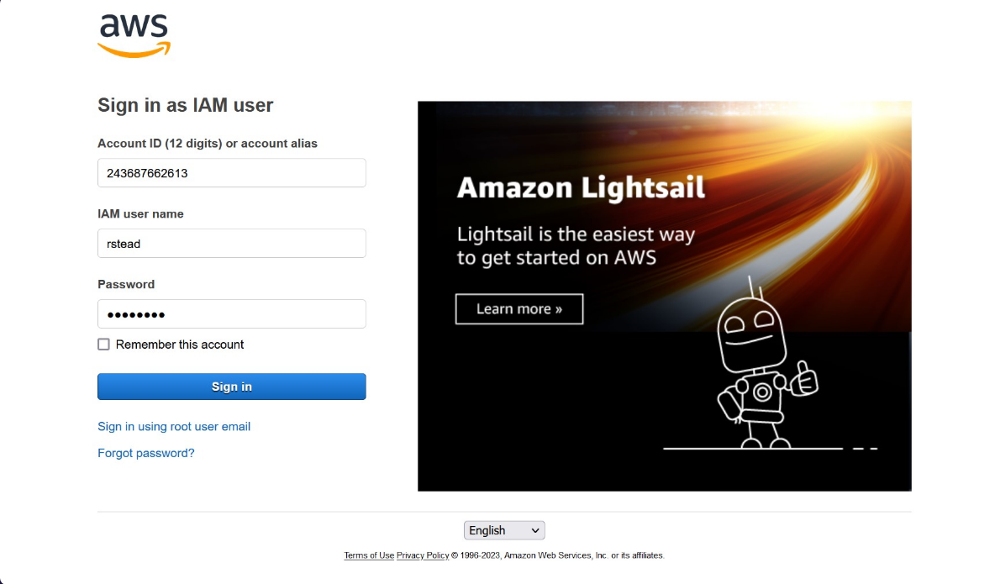

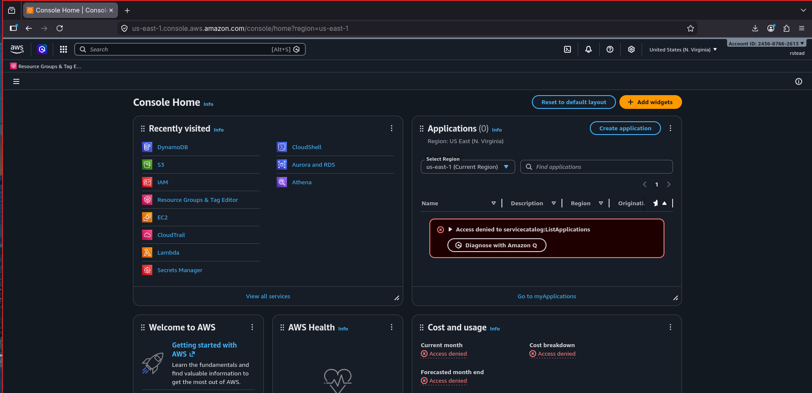

---

## Step 10 — Access restricted DynamoDB table

The `user_order_logs` table was not accessible via CLI but
was accessible through the console with rstead's permissions:

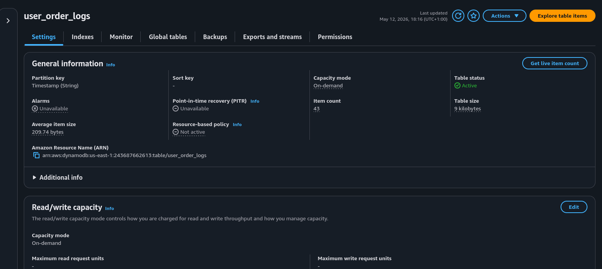

Found 43 items. Downloaded as CSV.

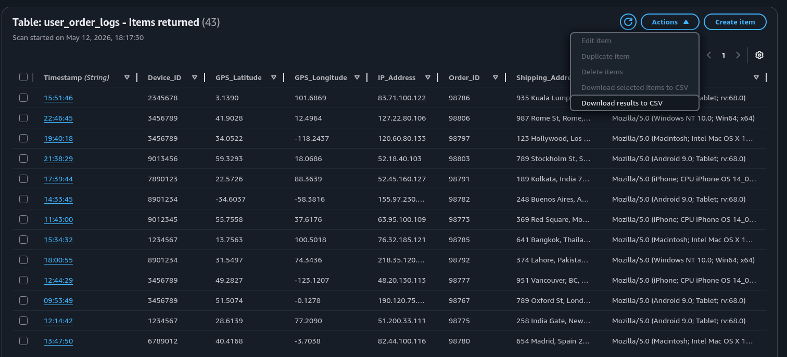

---

## Step 11 — Retrieve the flag

Found the flag in line 33 of the CSV:

**Flag:** `557449888acb256bda4e80e74c867751`

---

## Attack Chain SummaryBasically only the us-east-1 region has a dynamodb tables the others only have empty db as showen in the screentshot there 2 tables only 1 can be enumerated and downloadable the other one needs special permissions when pacu downloads something it is stored by defautl in 
/home/USERNAME/pacu/sessions/SESSIONNAME/downloads/ 
so in this path i found the downloaded file:
![[06-file-extracted.png]]

When i first opened the file i saw 51 users with emails first and last names roles and password hashes i made a file that has username:password format and used john to crack the password hashes 
![[07-cracked-passwords.png]]
I got only 18 crackes passwords out of 51
then we used a sprayer tools "GoAWSConsoleSpray" which is a very good tools that used for password spraying
Using this tool got me a valid user :
![[08-spray-success.png]]

I tested the connection to aws console 
![[10-breaking-into-the-account.png]]
As we know earlier we found 2 dynamodb tables one of them isn't accessible "user_order_logs"
![[11-checking-the-table.png]]
exploring the table items we find 43 item i downloaded them into csv
![[12-checking-the-table-content.png]]
after some search i found the flag in line 33
![[13-flag.png]]

## Security Failures & Fixes

| Failure | Fix |
|---|---|
| Public S3 bucket with sensitive backup | Enable Block Public Access |
| AWS credentials in backup JSON file | Use AWS Secrets Manager |
| Weak password hashes | Use bcrypt or argon2 |
| No MFA on IAM users | Enforce MFA for all users |
| Excessive DynamoDB permissions | Apply least privilege IAM |
| No threat detection | Enable GuardDuty |

## Key Takeaway

A single misconfigured public S3 bucket containing credentials
led to full AWS console access. Every step of this attack chain
was preventable with basic cloud security hygiene.